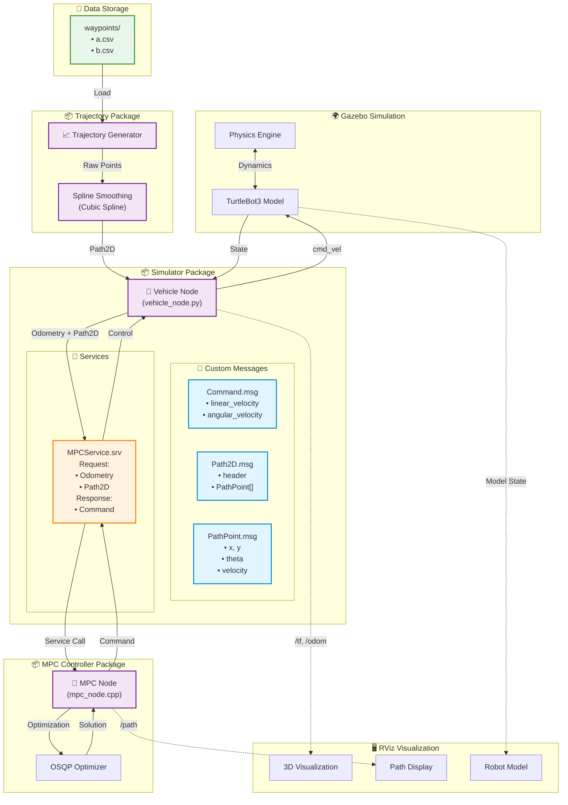

## System Architecture

```mermaid
graph TB
    subgraph Gazebo["🌍 Gazebo Simulation"]
        Physics["Physics Engine"]
        TurtleBot["TurtleBot3 Model"]
    end

    subgraph Simulator["📦 Simulator Package"]
        VehicleNode["🤖 Vehicle Node<br/>(vehicle_node.py)"]
        
        subgraph Messages["📨 Custom Messages"]
            Command["Command.msg<br/>• linear_velocity<br/>• angular_velocity"]
            Path2D["Path2D.msg<br/>• header<br/>• PathPoint[]"]
            PathPoint["PathPoint.msg<br/>• x, y<br/>• theta<br/>• velocity"]
        end
        
        subgraph Services["🔧 Services"]
            MPCService["MPCService.srv<br/>Request:<br/>• Odometry<br/>• Path2D<br/>Response:<br/>• Command"]
        end
    end

    subgraph MPCController["📦 MPC Controller Package"]
        MPCNode["🎯 MPC Node<br/>(mpc_node.cpp)"]
        Optimizer["OSQP Optimizer"]
    end

    subgraph Trajectory["📦 Trajectory Package"]
        TrajGen["📈 Trajectory Generator"]
        SplineSmooth["Spline Smoothing<br/>(Cubic Spline)"]
    end

    subgraph RViz["🖥️ RViz Visualization"]
        Display["3D Visualization"]
        PathViz["Path Display"]
        RobotModel["Robot Model"]
    end

    subgraph Data["💾 Data Storage"]
        Waypoints["waypoints/<br/>• a.csv<br/>• b.csv"]
    end

    %% Data flow connections
    Waypoints -->|Load| TrajGen
    TrajGen -->|Raw Points| SplineSmooth
    SplineSmooth -->|Path2D| VehicleNode
    
    %% Main control loop
    TurtleBot -->|State| VehicleNode
    VehicleNode -->|Odometry + Path2D| MPCService
    MPCService -->|Service Call| MPCNode
    MPCNode -->|Optimization| Optimizer
    Optimizer -->|Solution| MPCNode
    MPCNode -->|Command| MPCService
    MPCService -->|Control| VehicleNode
    VehicleNode -->|cmd_vel| TurtleBot
    
    %% Visualization
    VehicleNode -.->|/tf, /odom| Display
    MPCNode -.->|/path| PathViz
    TurtleBot -.->|Model State| RobotModel
    
    %% Physics simulation
    Physics <-->|Dynamics| TurtleBot

    %% Styling
    classDef messageClass fill:#e1f5ff,stroke:#0288d1,stroke-width:2px
    classDef serviceClass fill:#fff3e0,stroke:#f57c00,stroke-width:2px
    classDef nodeClass fill:#f3e5f5,stroke:#7b1fa2,stroke-width:2px
    classDef dataClass fill:#e8f5e9,stroke:#388e3c,stroke-width:2px
    
    class Command,Path2D,PathPoint messageClass
    class MPCService serviceClass
    class VehicleNode,MPCNode,TrajGen,SplineSmooth nodeClass
    class Waypoints,Smoothed dataClass
```