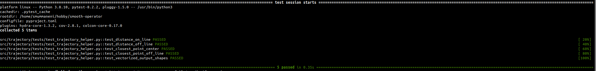

## 1. Test Case Design

Due to time constraints, I was unable to design comprehensive test cases for all components of the system. However, I have included a test suite I was writing for trajectory modeule, the coverage is only partial. I do have prior experience in writing unit test.

<tr>
<td width="50%">
    
    <p align="center"><em>PyTest Tracjectory Handler</em></p>
</td>
</tr>

**Note**: With additional time, I would expand this to include unit tests for each controller type (dumb, Stanley, MPC), integration tests for the full pipeline, and performance benchmarking tests.

## 2. Test Automation

I have limited expertise in setting up automated testing infrastructure for ROS projects. My understanding is that proper test automation would require:
- Docker containerization for reproducible test environments
- CI/CD pipeline configuration (e.g., GitHub Actions, Jenkins)
- ROS testing frameworks (rostest, gtest)

Given the time constraints and my current knowledge gap in this area, I was unable to implement automated testing. This is an area I recognize needs improvement and would prioritize learning for future projects.

## 3. Error Handling

The error handling approach in this implementation prioritizes robustness and graceful degradation rather than halting execution:

**Design Philosophy**:
- **No raised exceptions**: Instead of throwing errors that could crash the system, warnings are logged to notify developers of issues
- **Default safe behavior**: When invalid inputs or edge cases are encountered, the system falls back to safe default behaviors
- **Continuous operation**: The controller continues operating even when suboptimal conditions are detected

**Examples**:
```cpp
// Empty path handling - returns zero velocities instead of crashing
if (path.points.empty()) {
    ROS_WARN("Empty path received, returning zero velocities");
    return std::make_tuple(0.0, 0.0);
}

// Invalid index handling - clamps to valid range
if (lookahead_index >= path.points.size()) {
    ROS_WARN("Lookahead index out of bounds, using last point");
    lookahead_index = path.points.size() - 1;
}
```

This approach ensures the robot can continue operating safely even when unexpected situations arise, which is critical for real-time control systems where stopping abruptly could be more dangerous than continuing with reduced functionality.