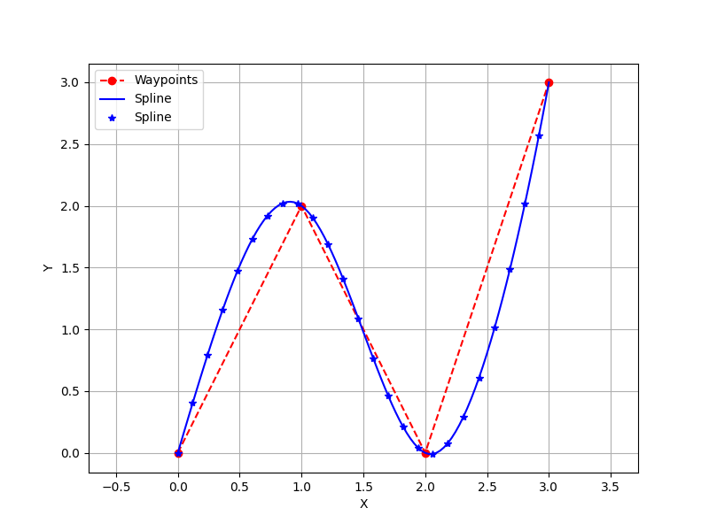
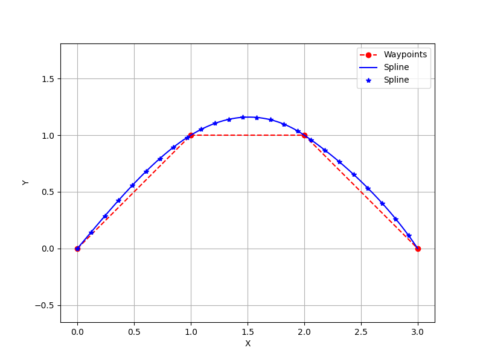
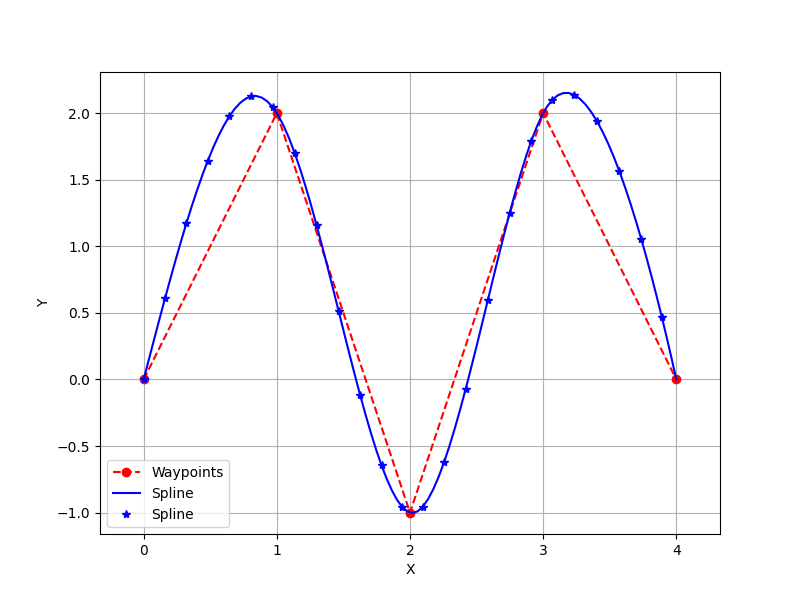
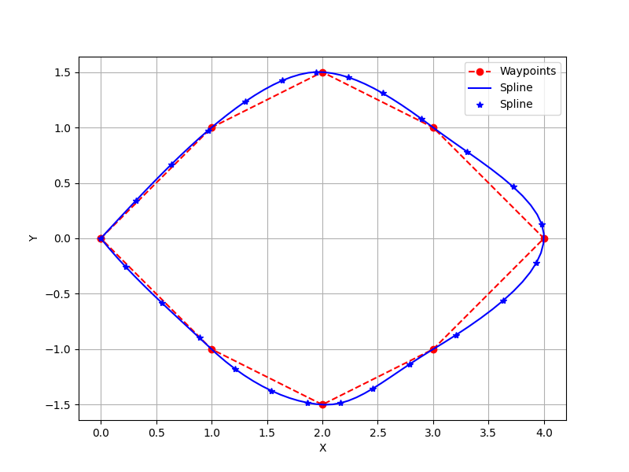
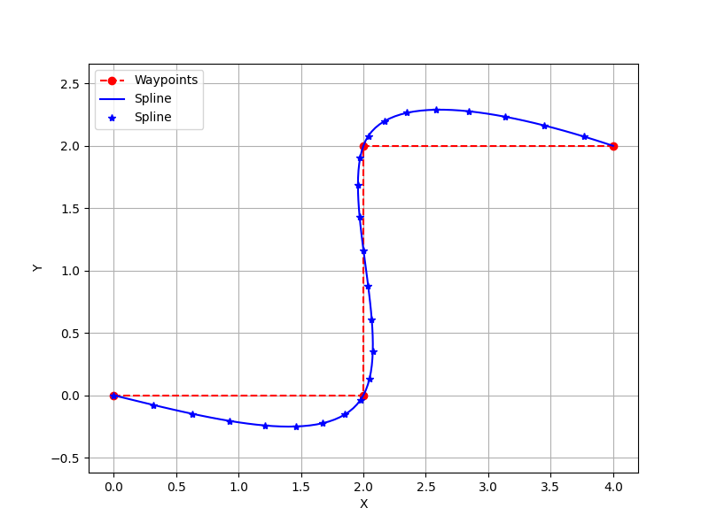
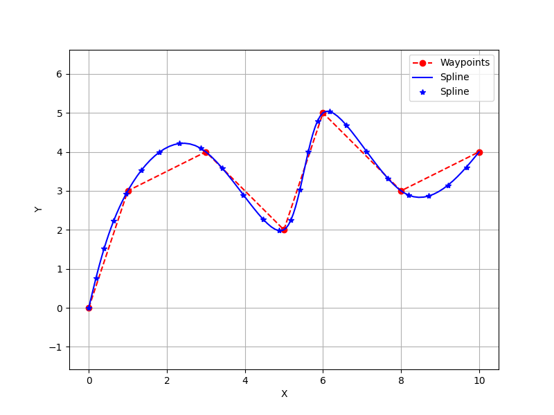
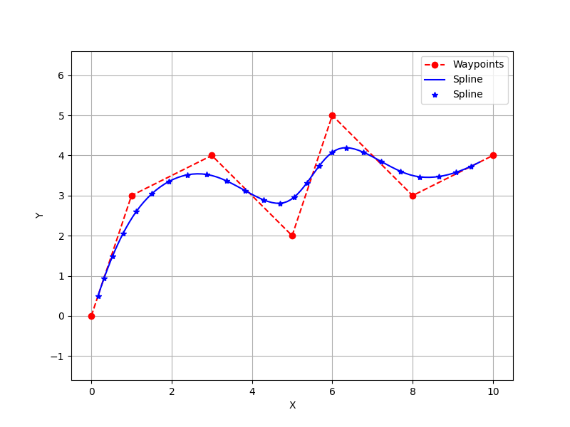
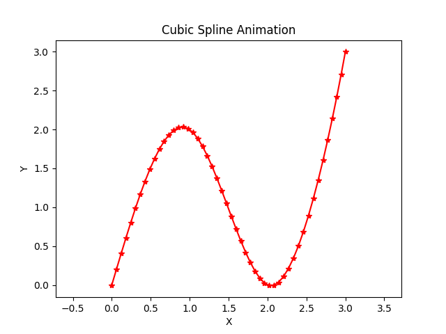
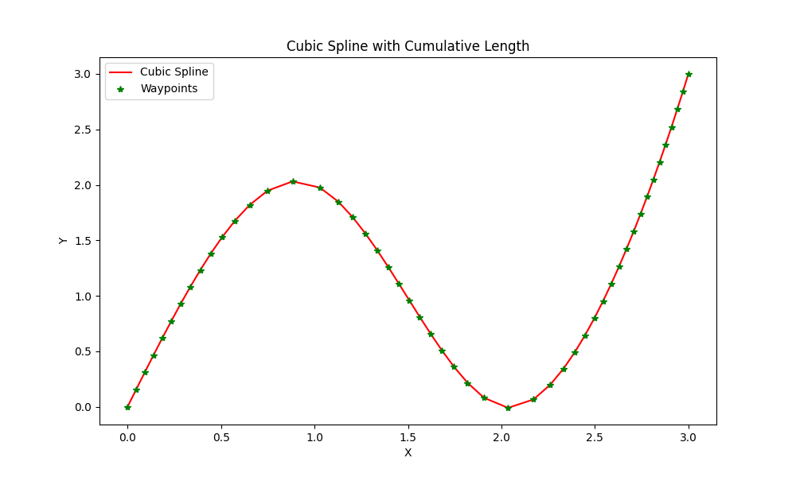
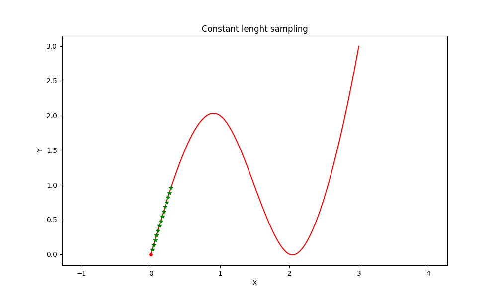

# Path Smoothing / Spline generation

**Goal**: A function that takes discrete waypoints and returns a smooth, continuous path.

The file that performs this operation is `utils/spline.py`
- For smoothing we used cubic spline.
- Given `[(x0, y0), (x1, y1), ..., (xn, yn)]` we get a function `spline(t)`
  - `t` -> curve is paramtrized over this
  - `(x, y) = spline(t)`
  - `t` ranges over `[0, n]` number of points is `n+1`
  - For each segment `x0,y0 = spline(t=0)` & `x1,y1 = spline(t=1)`

## Usage:
```python
points = np.array([[0, 0], [1, 2], [2, 0], [3, 3]])
spline = Spline(points)
```

## Cubic spline performance:

<table>
  <tr>
    <td width="50%">
      
      <p align="center"><em>Example 1: Simple curve</em></p>
    </td>
    <td width="50%">
      
      <p align="center"><em>Example 2: S-curve</em></p>
    </td>
  </tr>
  <tr>
    <td width="50%">
      
      <p align="center"><em>Example 3: Zigzag path</em></p>
    </td>
    <td width="50%">
      
      <p align="center"><em>Example 4: Circular path</em></p>
    </td>
  </tr>
  <tr>
    <td width="50%">
      
      <p align="center"><em>Example 5: Sharp turn</em></p>
    </td>
    <td width="50%">
      
      <p align="center"><em>Example 7: Complex path</em></p>
    </td>
    <td width="50%">
      <!-- Empty cell if you have odd number of images -->
    </td>
  </tr>
</table>

## Cubic vs beizer spline:

<table>
  <tr>
    <td width="50%">
      
      <p align="center"><em>Cubic spline</em></p>
    </td>
    <td width="50%">
      
      <p align="center"><em>Beizer spline</em></p>
    </td>
  </tr>
</table>


# Trajectory Generation / Re-parametrization'

**Goal**: Sample the path at regular lenght intervals

Methodology:
- We get curve lenght as function of `t`
  - Used gauss legendre method
- Then we can qeury the curve as a function of `s` -> `path lenght`
  - Used RK4 for speed
  - Also saved cache for faster computation
- All class methods are are all batched for faster speed

## Usage
```python
spline_t = Spline(points)   # Original
spline_s = SplineLenght(spline_t)   # New spline
# Query
s_sample = np.linspace(0, spline.n, 100)
spline_points = spline_s(s_sample)
# s <->t
t = spline_s.get_t_from_s(float)
```

## Cubic vs beizer spline:

<table>
  <tr>
    <td width="40%">
      
      <p align="center"><em>Orignial parameter</em></p>
    </td>
    <td width="50%">
      
      <p align="center"><em>Lenght based Sampling</em></p>
    </td>
  </tr>
</table>

## Sampling for downstream nodes
<tr>
<td width="50%">
    
    <p align="center"><em>Sampling needed for path tracking</em></p>
</td>
</tr>

